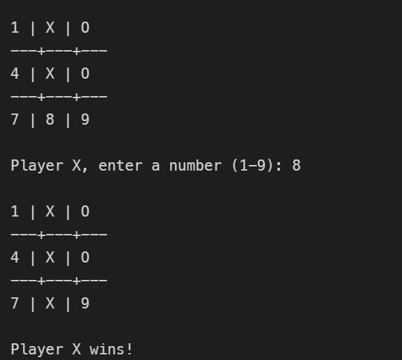
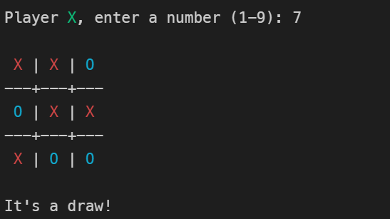

<h1>汇编语言实现的井字棋 Tic-Tac-Toe</h1>

这是一个在 Linux 平台上使用 x86_64 汇编语言编写的简单井字棋（Tic-Tac-Toe）命令行游戏。

## 环境要求

- Ubuntu 或其他兼容的 Linux 发行版
- `nasm`： Netwide Assembler，用于汇编源代码
- `ld`： GNU Linker，用于链接目标文件
- `make`： 用于简化构建过程的工具

在 Ubuntu 上安装依赖：

```bash
sudo apt-get update
sudo apt-get install nasm make
```

## 编译与构建

项目包含一个 `Makefile`，可以方便地进行编译。

### 使用 Make (推荐)

```bash
# 编译项目
make
# 清除生成的文件
make clean
```

### 手动编译

如果你不想使用 make，可以手动运行以下命令：

```bash
# 汇编源码
nasm -f elf64 main.asm -o main.o

# 链接生成可执行文件
ld main.o -o main
```

## 运行游戏

编译完成后，运行生成的可执行文件：

```bash
./main
```

## 游戏规则

1. 游戏在一个 3x3 的网格上进行，初始时每个格子标记为数字 1-9。
2. 玩家 **X** 先手，玩家 **O** 后手。
3. 轮到你时，输入你想落子的格子对应的数字（1-9），然后按回车键。
4. 率先在横向、纵向或对角线上连成一条线的玩家获胜。
5. 如果所有格子都被填满且没有人获胜，则游戏平局。


### 游戏运行示例

```text

 1 | 2 | 3 
---+---+---
 4 | 5 | 6 
---+---+---
 7 | 8 | 9 

Player X, enter a number (1-9): 5

 1 | 2 | 3 
---+---+---
 4 | X | 6 
---+---+---
 7 | 8 | 9 

Player O, enter a number (1-9): 
```
- 胜利


- 平局


## 代码实现

### 主要使用功能

- **系统调用 (System Calls)**: 直接使用 Linux 内核系统调用进行 I/O 操作。
  - `sys_write (rax=1)`: 用于屏幕输出。
  - `sys_read (rax=0)`: 用于读取用户输入。
  - `sys_exit (rax=60)`: 用于程序退出。
- **内存管理**:
  - `.data` 段：存储预定义的字符串、棋盘状态和提示信息。
  - `.bss` 段：预留空间存储用户输入。
- **程序逻辑**:
  - 使用 `cmp` 和跳转指令 (`je`, `jmp`) 实现游戏循环和条件判断。
  - 使用 `call` 和 `ret` 组织子程序（如打印棋盘、检查胜负）。
  - 寄存器传参：主要使用 `rax`, `rdi`, `rsi`, `rdx` 传递系统调用参数。

### 具体代码实现

代码主要分为三个段：`.data`、`.bss` 和 `.text`。

1.  **数据定义 (`.data`)**
    -   `board`: 使用 9 个字节的数组存储棋盘状态，初始值为 '1'-'9'。
    -   `player`: 存储当前玩家，'X' 或 'O'。
    -   各种提示信息字符串（如 "Player X, enter a number..."）。

2.  **主循环 (`_start` & `game_loop`)**
    -   程序入口 `_start` 初始化游戏。
    -   `game_loop` 是游戏的核心循环：
        1.  `call print_board`: 打印当前棋盘。
        2.  `call get_move`: 获取玩家输入。
        3.  `call check_win`: 检查是否有玩家获胜。
        4.  `call check_draw`: 检查是否平局。
        5.  `call switch_player`: 切换当前玩家。
        6.  跳转回 `game_loop` 继续。

3.  **输入处理 (`get_move`)**
    -   使用 `sys_read` 读取用户输入的字符。
    -   验证输入是否在 '1'-'9' 范围内。
    -   检查目标位置是否已经被占用（即不等于 'X' 或 'O'）。
    -   如果输入无效，递归调用 `get_move` 重新获取。

4.  **胜负判定 (`check_win`)**
    -   通过 `check_rows`、`check_cols`、`check_diags` 分别检查行、列、对角线。
    -   直接比较内存中 `board` 数组特定偏移量的字节值。
    -   如果发现三个连续相同的字符，则返回 1 (rax=1)。

5.  **绘图逻辑 (`print_board`)**
    -   虽然是命令行界面，但通过打印 `|` 和 `---+---+---` 字符构建了可视化的网格。
    -   通过计算偏移量直接访问 `board` 数组中的字符并打印。
    -   **彩色支持**：在打印 'X' 或 'O', 以及打印当前玩家时，先输出对应的 ANSI 颜色代码（如 `\033[31m`），打印字符后再重置颜色 (`\033[0m`)。

## 心得体会

通过本项目，我对汇编语言编程有了更深入的实践和理解：

1.  **数据管理与内存操作**：在汇编语言中，程序员需要手动管理内存和数据的存储结构。本项目通过定义 `.data` 和 `.bss` 段来存储棋盘状态、玩家信息和临时输入，展示了如何使用汇编语言直接管理程序的内存布局。
2.  **输入输出与系统调用**：在汇编中，输入输出操作通常依赖于操作系统提供的接口。本项目在 Linux 环境下通过 `syscall` 指令直接调用内核服务（如 `sys_read` 和 `sys_write`），展示了现代操作系统下汇编语言如何处理用户交互。
3.  **流程控制与条件判断**：汇编语言的流程控制依赖于条件跳转和标签。本项目通过 `cmp` 比较指令配合 `je`、`jmp` 等跳转指令，实现了游戏循环、胜负判断和非法输入检测等复杂的逻辑控制。
4.  **子程序与模块化**：为了提高代码的可读性和可维护性，本项目将功能封装为多个子程序（如 `print_board`、`get_move`、`check_win` 等）。这种模块化的设计思想在汇编语言中尤为重要，有助于组织复杂的程序结构。
5.  **手动管理程序状态**：在汇编中，程序状态和标志的管理完全由开发者控制。例如，通过 `player` 变量指示当前玩家，通过检查 `board` 数组的状态来决定游戏是否结束。每次操作后手动更新这些状态，从而精确控制游戏流程。
